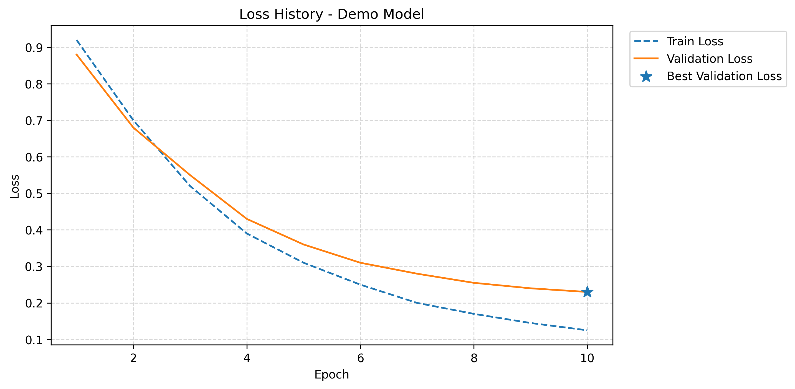
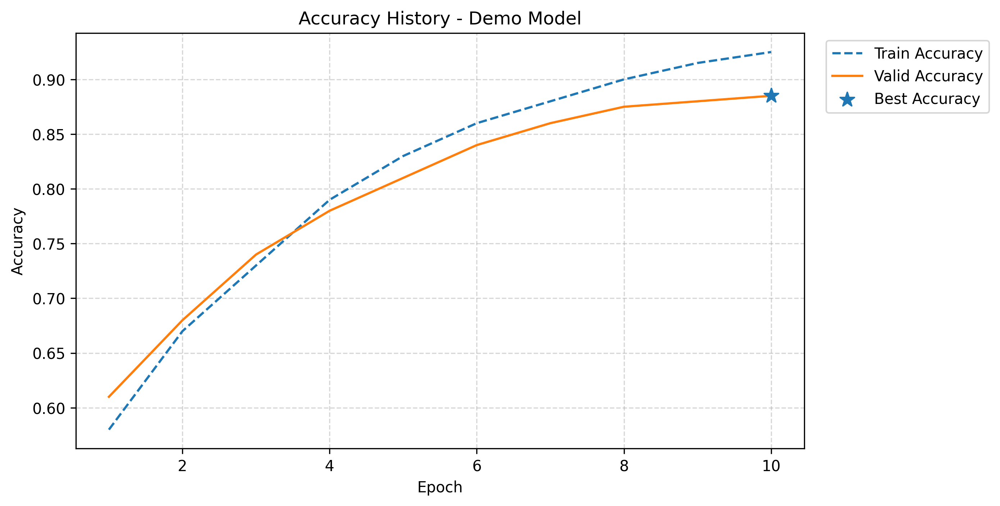

# Visualization

This example demonstrates a practical visualization workflow with DanFlow.

The workflow is divided into two stages:

```text
Data Visualization
    Dataset
    Feature Relationships
    Feature Distributions
    Feature Spread

Training Visualization
    Loss History
    Metric History
    Combined Training History
```

The examples use one deterministic dataset and one training history so the outputs can be reproduced consistently.

## Prepare the Data

Create a numerical `DataFrame` that will be reused throughout the data-visualization examples.

```python
import pandas as pd

data = pd.DataFrame({
    "feature_1": [10, 12, 13, 15, 17, 18, 20, 22, 24, 25],
    "feature_2": [8, 11, 12, 14, 16, 17, 19, 21, 23, 24],
    "feature_3": [30, 28, 27, 25, 24, 22, 20, 19, 17, 16],
    "feature_4": [5, 7, 6, 9, 8, 11, 10, 13, 12, 14],
    "target":    [12, 14, 15, 17, 19, 20, 22, 24, 26, 27],
})
```

```pycon
>>> data.shape
(10, 5)

>>> list(data.columns)
['feature_1', 'feature_2', 'feature_3', 'feature_4', 'target']
```

## Data Visualization

### Correlation Heatmap

Use a correlation heatmap to inspect relationships between numerical columns.

```python
from danflow.visualization.data import plot_correlation_heatmap

plot_correlation_heatmap(
    data,
    figsize=(8, 6),
)
```

```pycon
>>> plot_correlation_heatmap(data, figsize=(8, 6))
```


### Single-Feature Histogram

Inspect the distribution of one feature with a histogram.

```python
from danflow.visualization.data import plot_histogram

plot_histogram(
    data,
    column="feature_1",
    bins=5,
    figsize=(8, 5),
)
```

```pycon
>>> plot_histogram(data, column="feature_1", bins=5, figsize=(8, 5))
```


### Multiple Histograms

Compare the distributions of several columns in one figure.

```python
from danflow.visualization.data import plot_multi_histograms

plot_multi_histograms(
    data,
    columns=[
        "feature_1",
        "feature_2",
        "feature_3",
        "feature_4",
        "target",
    ],
    name="Feature Distributions",
    bins=5,
)
```

```pycon
>>> plot_multi_histograms(
...     data,
...     columns=[
...         "feature_1",
...         "feature_2",
...         "feature_3",
...         "feature_4",
...         "target",
...     ],
...     name="Feature Distributions",
...     bins=5,
... )
```


### Single-Feature Box Plot

Inspect the spread of one feature with a box plot.

```python
from danflow.visualization.data import plot_boxplot

plot_boxplot(
    data,
    column="feature_2",
    figsize=(8, 5),
)
```

```pycon
>>> plot_boxplot(data, column="feature_2", figsize=(8, 5))
```


### Multiple Box Plots

Compare the spread of several features in one figure.

```python
from danflow.visualization.data import plot_multi_boxplots

plot_multi_boxplots(
    data,
    columns=[
        "feature_1",
        "feature_2",
        "feature_3",
        "feature_4",
    ],
    name="Feature Spread",
)
```

```pycon
>>> plot_multi_boxplots(
...     data,
...     columns=[
...         "feature_1",
...         "feature_2",
...         "feature_3",
...         "feature_4",
...     ],
...     name="Feature Spread",
... )
```


## Training Visualization

Use the training-history functions after `Trainer.fit()` has produced a history dictionary.

```python
history = {
    "train_loss": [0.92, 0.70, 0.52, 0.39, 0.31, 0.25, 0.20, 0.17, 0.145, 0.125],
    "valid_loss": [0.88, 0.68, 0.55, 0.43, 0.36, 0.31, 0.28, 0.255, 0.24, 0.23],
    "train_metric": [0.58, 0.67, 0.73, 0.79, 0.83, 0.86, 0.88, 0.90, 0.915, 0.925],
    "valid_metric": [0.61, 0.68, 0.74, 0.78, 0.81, 0.84, 0.86, 0.875, 0.88, 0.885],
    "metric_name": "Accuracy",
    "best_loss_epoch": 10,
    "best_metric_epoch": 10,
}
```

### Loss History

Use `plot_loss_history()` when the main question is how training and validation loss changed over epochs.

```python
from danflow.visualization.training import plot_loss_history

plot_loss_history(
    history,
    name="Demo Model",
    show_best_loss=True,
)
```

```pycon
>>> plot_loss_history(
...     history,
...     name="Demo Model",
...     show_best_loss=True,
... )
```



### Metric History

Use `plot_metric_history()` when the main question is how the training and validation metric changed over epochs.

```python
from danflow.visualization.training import plot_metric_history

plot_metric_history(
    history,
    name="Demo Model",
    show_best_metric=True,
)
```

```pycon
>>> plot_metric_history(
...     history,
...     name="Demo Model",
...     show_best_metric=True,
... )
```



### Combined Training History

Use `plot_training_history()` when both loss and metric should be inspected in one figure.

```python
from danflow.visualization.training import plot_training_history

plot_training_history(
    history,
    name="Demo Model",
    show_best_loss=True,
    show_best_metric=True,
)
```

```pycon
>>> plot_training_history(
...     history,
...     name="Demo Model",
...     show_best_loss=True,
...     show_best_metric=True,
... )
```


## Saving Plots

Data-visualization functions can save to a filename or a directory-like path.

```python
plot_histogram(
    data,
    column="feature_1",
    save_path="plots/feature_1_histogram.png",
)
```

```python
plot_boxplot(
    data,
    column="feature_1",
    save_path="plots",
)
```

Training-history functions treat `save_path` as the output file path.

```python
plot_loss_history(
    history,
    name="Demo Model",
    save_path="plots/loss_history.png",
)

plot_metric_history(
    history,
    name="Demo Model",
    save_path="plots/metric_history.png",
)
```

## Complete Visualization Workflow

The same dataset and history can be inspected with the full set of DanFlow visualization utilities.

```python
from danflow.visualization.data import (
    plot_correlation_heatmap,
    plot_multi_histograms,
    plot_multi_boxplots,
)

from danflow.visualization.training import (
    plot_loss_history,
    plot_metric_history,
    plot_training_history,
)

# Data visualization
plot_correlation_heatmap(data)

plot_multi_histograms(
    data,
    columns=["feature_1", "feature_2", "feature_3", "feature_4", "target"],
    name="Feature Distributions",
)

plot_multi_boxplots(
    data,
    columns=["feature_1", "feature_2", "feature_3", "feature_4"],
    name="Feature Spread",
)

# Training visualization
plot_loss_history(
    history,
    name="Demo Model",
    show_best_loss=True,
)

plot_metric_history(
    history,
    name="Demo Model",
    show_best_metric=True,
)

plot_training_history(
    history,
    name="Demo Model",
    show_best_loss=True,
    show_best_metric=True,
)
```

The workflow provides both views of the model-development process:

```text
Data Visualization
    Dataset Structure
    Feature Relationships
    Feature Distributions
    Feature Spread

Training Visualization
    Loss History
    Metric History
    Combined Training History
```

The resulting figures can then be used when inspecting the dataset and reviewing model-training behavior.