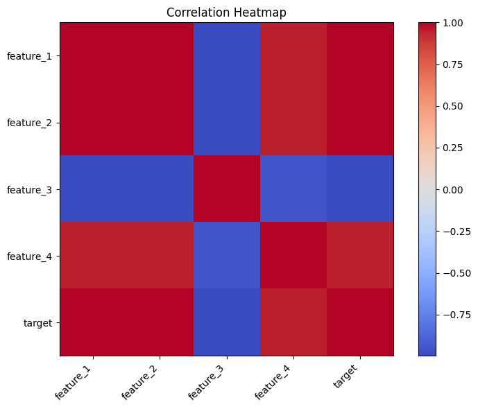
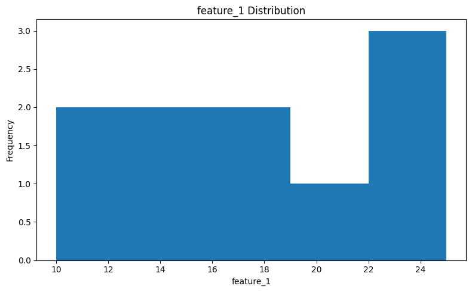
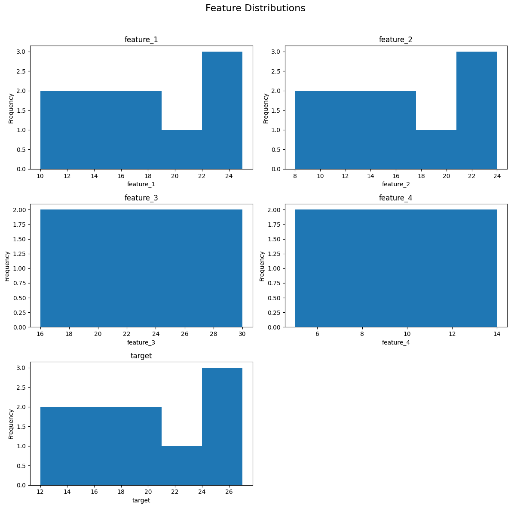
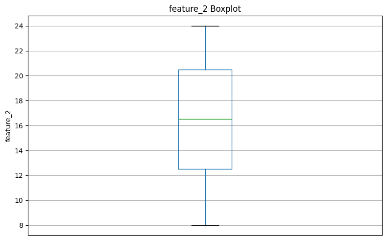
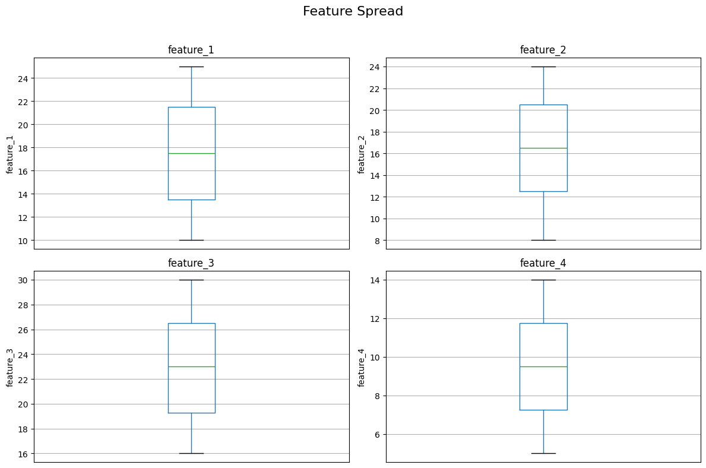
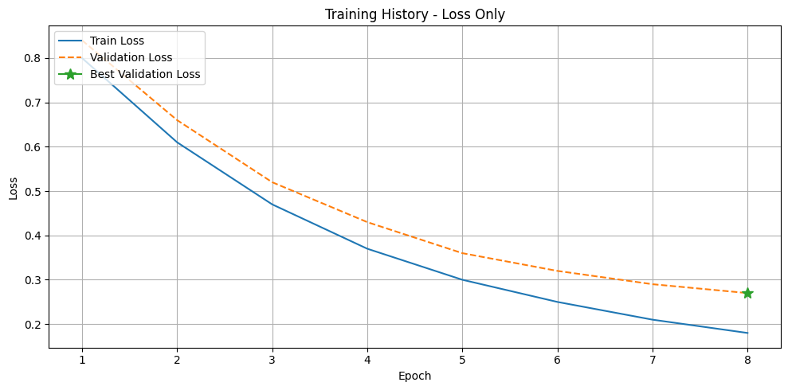
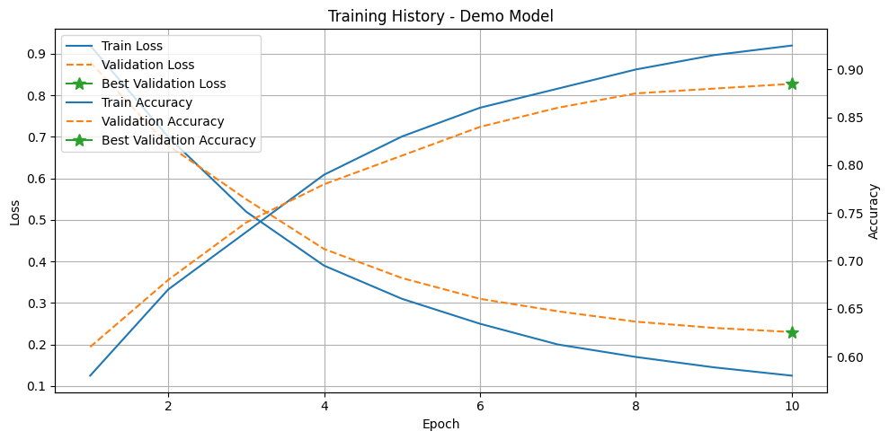

# Visualization

This example demonstrates how to use DanFlow's visualization utilities during exploratory data analysis and after model training.

The visualization API is split into two groups:

* `danflow.visualization.data` for feature-level plots.
* `danflow.visualization.training` for training-history plots.

The examples below use one small deterministic dataset so that every plot is reproducible.

## Prepare the Data

Create a numerical `DataFrame` that will be reused throughout the data-visualization examples.

```python
import pandas as pd

data = pd.DataFrame({
    "feature_1": [10, 12, 13, 15, 17, 18, 20, 22, 24, 25],
    "feature_2": [8, 11, 12, 14, 16, 17, 19, 21, 23, 24],
    "feature_3": [30, 28, 27, 25, 24, 22, 20, 19, 17, 16],
    "feature_4": [5, 7, 6, 9, 8, 11, 10, 13, 12, 14],
    "target":    [12, 14, 15, 17, 19, 20, 22, 24, 26, 27],
})
```

```pycon
>>> data.shape
(10, 5)
>>> list(data.columns)
['feature_1', 'feature_2', 'feature_3', 'feature_4', 'target']
```

The same `data` object is reused for the following plots.

## Data Visualization

### Correlation Heatmap

`plot_correlation_heatmap()` visualizes the correlation matrix of the numerical columns in a `DataFrame`.

```python
from danflow.visualization.data import plot_correlation_heatmap

plot_correlation_heatmap(
    data,
    figsize=(8, 6),
)
```

```pycon
>>> plot_correlation_heatmap(data, figsize=(8, 6))
```



The function computes correlations with `df.corr(numeric_only=True)`, so non-numeric columns are excluded from the matrix.

### Single-Feature Histogram

Use `plot_histogram()` when the distribution of one feature needs to be inspected.

```python
from danflow.visualization.data import plot_histogram

plot_histogram(
    data,
    column="feature_1",
    bins=5,
    figsize=(8, 5),
)
```

```pycon
>>> plot_histogram(data, column="feature_1", bins=5, figsize=(8, 5))
```



The plot title is generated from the selected column name.

### Multiple Histograms

`plot_multi_histograms()` compares the distributions of several columns in one figure.

```python
from danflow.visualization.data import plot_multi_histograms

plot_multi_histograms(
    data,
    columns=[
        "feature_1",
        "feature_2",
        "feature_3",
        "feature_4",
        "target",
    ],
    name="Feature Distributions",
    bins=5,
)
```

```pycon
>>> plot_multi_histograms(
...     data,
...     columns=[
...         "feature_1",
...         "feature_2",
...         "feature_3",
...         "feature_4",
...         "target",
...     ],
...     name="Feature Distributions",
...     bins=5,
... )
```



The function arranges plots in two columns and automatically removes any unused subplot.

### Single-Feature Box Plot

Use `plot_boxplot()` to inspect the spread and potential outliers of one feature.

```python
from danflow.visualization.data import plot_boxplot

plot_boxplot(
    data,
    column="feature_2",
    figsize=(8, 5),
)
```

```pycon
>>> plot_boxplot(data, column="feature_2", figsize=(8, 5))
```



### Multiple Box Plots

`plot_multi_boxplots()` provides the same view for several columns at once.

```python
from danflow.visualization.data import plot_multi_boxplots

plot_multi_boxplots(
    data,
    columns=[
        "feature_1",
        "feature_2",
        "feature_3",
        "feature_4",
    ],
    name="Feature Spread",
)
```

```pycon
>>> plot_multi_boxplots(
...     data,
...     columns=[
...         "feature_1",
...         "feature_2",
...         "feature_3",
...         "feature_4",
...     ],
...     name="Feature Spread",
... )
```



Both `plot_multi_histograms()` and `plot_multi_boxplots()` raise `ValueError` when `columns` is empty.

## Training Visualization

### Plot Training and Validation Loss

After training, `Trainer.fit()` returns a history dictionary containing training and validation losses.

```python
from danflow.visualization.training import plot_training_history

history = {
    "train_loss": [0.80, 0.61, 0.47, 0.37, 0.30, 0.25, 0.21, 0.18],
    "valid_loss": [0.84, 0.66, 0.52, 0.43, 0.36, 0.32, 0.29, 0.27],
    "best_loss_epoch": 8,
}

plot_training_history(
    history,
    name="Loss Only",
    show_best_loss=True,
)
```

```pycon
>>> plot_training_history(history, name="Loss Only", show_best_loss=True)
```



### Plot Training and Validation Metrics

When the history also contains `train_metric`, `valid_metric`, and `metric_name`, DanFlow adds the metric curves on a second y-axis.

```python
history = {
    "train_loss": [0.92, 0.70, 0.52, 0.39, 0.31, 0.25, 0.20, 0.17, 0.145, 0.125],
    "valid_loss": [0.88, 0.68, 0.55, 0.43, 0.36, 0.31, 0.28, 0.255, 0.24, 0.23],
    "train_metric": [0.58, 0.67, 0.73, 0.79, 0.83, 0.86, 0.88, 0.90, 0.915, 0.925],
    "valid_metric": [0.61, 0.68, 0.74, 0.78, 0.81, 0.84, 0.86, 0.875, 0.88, 0.885],
    "metric_name": "Accuracy",
    "best_loss_epoch": 10,
    "best_metric_epoch": 10,
}

plot_training_history(
    history,
    name="Demo Model",
    show_best_loss=True,
    show_best_metric=True,
)
```

```pycon
>>> plot_training_history(
...     history,
...     name="Demo Model",
...     show_best_loss=True,
...     show_best_metric=True,
... )
```



`show_best_loss=True` highlights the best validation-loss epoch, while `show_best_metric=True` highlights the best validation-metric epoch.

## Saving Plots

The data-visualization functions accept either a file path or a directory-like path.

For example:

```python
plot_histogram(
    data,
    column="feature_1",
    save_path="plots/feature_1_histogram.png",
)
```

```python
plot_boxplot(
    data,
    column="feature_1",
    save_path="plots",
)
```

When the path is treated as a directory, the data-visualization functions generate their own filename.

`plot_training_history()` differs: it treats `save_path` as the output file path rather than applying the same directory-filename convention.

## A Typical Workflow

A practical exploratory workflow is to inspect the same dataset from several perspectives:

```python
from danflow.visualization.data import (
    plot_correlation_heatmap,
    plot_multi_histograms,
    plot_multi_boxplots,
)

plot_correlation_heatmap(data)

plot_multi_histograms(
    data,
    columns=[
        "feature_1",
        "feature_2",
        "feature_3",
        "feature_4",
        "target",
    ],
    name="Feature Distributions",
)

plot_multi_boxplots(
    data,
    columns=[
        "feature_1",
        "feature_2",
        "feature_3",
        "feature_4",
    ],
    name="Feature Spread",
)
```

```pycon
>>> plot_correlation_heatmap(data)
>>> plot_multi_histograms(
...     data,
...     columns=["feature_1", "feature_2", "feature_3", "feature_4", "target"],
...     name="Feature Distributions",
... )
>>> plot_multi_boxplots(
...     data,
...     columns=["feature_1", "feature_2", "feature_3", "feature_4"],
...     name="Feature Spread",
... )
```

These plots provide complementary information:

* The correlation heatmap shows linear relationships between numerical variables.
* Histograms show feature distributions.
* Box plots show spread and potential outliers.
* Training-history plots show how model performance changes across epochs.

After model training, `plot_training_history()` can be used to inspect whether training and validation behavior are aligned and where the best recorded validation result occurred.